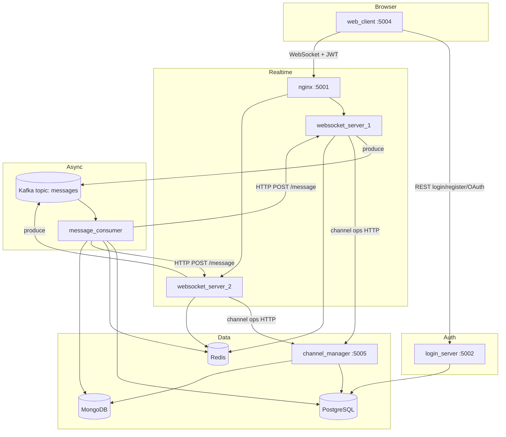
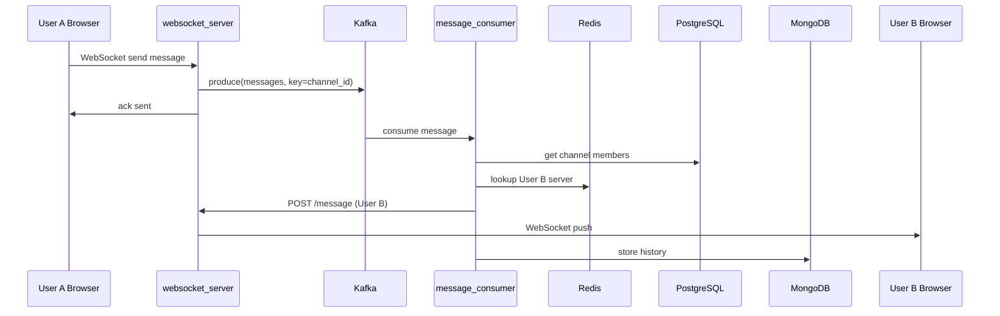

# Realtime Chat — Project Report & Interview Guide

A **distributed, event-driven realtime chat** built with **FastAPI microservices**, **Apache Kafka**, **WebSockets**, and **polyglot persistence** (PostgreSQL, MongoDB, Redis). Deployed locally via Docker Compose and in production on **Render** with **Confluent Cloud Kafka**.


> **How to use this document:** Read sections 1–8 to explain the project end-to-end in an interview. Sections 9–12 cover tool choices, trade-offs, and reliability/scalability. Section 13 is your Render env checklist.

---

## Table of Contents

1. [What This Project Does](#1-what-this-project-does)
2. [High-Level Architecture](#2-high-level-architecture)
3. [End-to-End Workflows](#3-end-to-end-workflows)
4. [Data: What Lives Where](#4-data-what-lives-where)
5. [Services Deep Dive](#5-services-deep-dive)
6. [Environment Variables & Service Wiring](#6-environment-variables--service-wiring)
7. [WebSocket Request Protocol](#7-websocket-request-protocol)
8. [Production Deployment (Render)](#8-production-deployment-render)
9. [Why These Tools? (Interview Answers)](#9-why-these-tools-interview-answers)
10. [Advantages & Disadvantages](#10-advantages--disadvantages)
11. [Reliability, Scalability & Efficiency](#11-reliability-scalability--efficiency)
12. [Interview Cheat Sheet](#12-interview-cheat-sheet)
13. [Quick Start (Local)](#13-quick-start-local)
14. [Troubleshooting](#14-troubleshooting)

---

## 1. What This Project Does

| Capability | How |
|------------|-----|
| Register / login (email + password) | `login_server` → PostgreSQL `users` |
| Google OAuth sign-in | `web_client` → Google → `login_server` creates user + JWT |
| Create / search / join channels | Browser → WebSocket → `websocket_server` → `channel_manager` → PostgreSQL |
| Send chat messages in real time | WebSocket → Kafka → `message_consumer` → fan-out to all channel members |
| Load message history | WebSocket → `channel_manager` → MongoDB |
| Scale WebSocket layer | 2× `websocket_server` behind **nginx** + **Redis** routing |

**Main URLs (local):** UI `http://localhost:5004` · WebSocket `ws://localhost:5001/ws`

**Seed channel:** `The Tortured Poets Department` (not `Channel2`)

---

## 2. High-Level Architecture



### Communication patterns

| Pattern | Used for | Example |
|---------|----------|---------|
| **REST (HTTP)** | Auth, channel CRUD, internal message delivery | `POST /channels/join`, `POST /message` |
| **WebSocket** | Live chat, channel UI operations | `ws://host/ws?token=JWT` |
| **Kafka pub/sub** | Decouple message send from delivery | Topic `messages`, key = `channel_id` |
| **Server-side session (cookie)** | OAuth `state` during Google redirect | `oauth_session` cookie in `web_client` |

---

## 3. End-to-End Workflows

### 3.1 User registration & login (password)

```
Browser → web_client (form)
       → POST login_server /register or /token
       → PostgreSQL: insert/verify users (bcrypt password_hash)
       → login_server returns JWT (RS256, signed with private key)
       → web_client stores session cookie (session_id → username + token)
       → Redirect to /channels
```

### 3.2 Google OAuth login

```
Browser → GET web_client /auth/google/login
       → Redirect to Google consent screen
       → Google redirects to GOOGLE_REDIRECT_URI (/auth/google/callback)
       → web_client exchanges code (Authlib) — redirect_uri set once in oauth.register()
       → web_client POST login_server /auth/google { email, name, ... }
       → login_server upserts user in PostgreSQL, returns JWT
       → web_client sets session cookie → /channels
```

**Critical env vars:** `GOOGLE_CLIENT_ID`, `GOOGLE_CLIENT_SECRET`, `GOOGLE_REDIRECT_URI`, `LOGIN_SERVER_URL`

### 3.3 Open channels page

```
Browser loads /channels (must have session cookie)
       → web_client injects JWT + WEBSOCKET_CLIENT_URL into template
       → JavaScript opens WebSocket: ws://.../ws?token=<JWT>
       → websocket_server validates JWT with PUBLIC_KEY
       → Redis HSET active_connections {username → SERVER_URL}
       → Client sends WebSocket request type=1, operation=2 (list my channels)
       → websocket_server GET channel_manager /channels/me/{username}
       → Returns channel list from PostgreSQL (join user_channels + channels)
```

### 3.4 Create channel

```
User fills modal → JS checks name via operation=3 (search by name)
       → If duplicate: friendly alert (no server create)
       → Else operation=1 → websocket_server POST channel_manager /channels/
       → PostgreSQL INSERT channels (unique channel_name)
       → On success: auto-join (operation=0) → POST /channels/join
```

### 3.5 Join channel

```
User clicks Join → WebSocket operation=0 { channel_id }
       → websocket_server POST channel_manager /channels/join
       → Validates user exists in users, channel exists, not already member
       → INSERT user_channels (username, channel_id)
       → Browser redirects to /chat/{channel_id}
```

**Important:** `login_server` and `channel_manager` must use the **same `DATABASE_URL`** so Google-created users exist for join.

### 3.6 Send a chat message (core realtime flow)

```
User types message in /chat/{id}
       → WebSocket JSON: { "type": 0, "data": "<Message JSON>" }
       → websocket_server validates Message model
       → Kafka Producer: topic "messages", key=str(channel_id), value=message JSON
       → Ack to sender: { "status": "sent", "message_id": "..." }

Kafka → message_consumer (consumer group) receives message
       → PostgreSQL: SELECT usernames FROM user_channels WHERE channel_id = ?
       → For each member (except sender):
            Redis HGET active_connections username → websocket server host
            HTTP POST http://{server}/message { message, username }
       → websocket_server pushes JSON to user's WebSocket
       → MongoDB: insert message document (history)
```



### 3.7 Load message history

```
User opens /chat/{channel_id}
       → WebSocket operation=4 { channel_id }
       → websocket_server GET channel_manager /channels/messages/{channel_id}
       → MongoDB query messages by channel_id, sorted by timestamp
       → Returns MessageCollection → UI renders with date dividers
```

---

## 4. Data: What Lives Where

### 4.1 PostgreSQL (`chatdb`) — relational / transactional

| Table | Purpose | Key fields |
|-------|---------|------------|
| `users` | Accounts | `username` PK, `email`, `password_hash`, names |
| `channels` | Chat rooms | `id` PK, `channel_name` UNIQUE, `description` |
| `user_channels` | Membership (M:N) | `(username, channel_id)` PK, FKs to users & channels |

**Why PostgreSQL here:** ACID transactions, foreign keys, joins for “who is in this channel?” — required for correct membership and auth data.

### 4.2 MongoDB (`chatdb.messages`) — document / append-heavy

| Field | Type | Purpose |
|-------|------|---------|
| `message_id` | string | Client-generated UUID (unique index) |
| `channel_id` | int | Partition messages per channel |
| `timestamp` | string (ISO) | Ordering & UI date dividers |
| `username` | string | Sender |
| `message` | string | Text content |

**Indexes:** `message_id` (unique), `channel_id`, `timestamp`, compound `(channel_id, timestamp)`

**Why MongoDB here:** High-volume append-only chat logs, flexible schema, fast range queries by `channel_id` — no need for strict relational joins on every message read.

### 4.3 Redis — ephemeral routing

| Key | Type | Value | Purpose |
|-----|------|-------|---------|
| `active_connections` | Hash | `username` → `websocket_server_1:80` | Route fan-out to correct WS instance |

**Why Redis:** Sub-millisecond lookups; data is disposable (rebuilt on reconnect). Not used as source of truth.

### 4.4 Kafka — message bus

| Topic | Key | Value | Partitions (local) |
|-------|-----|-------|-------------------|
| `messages` | `channel_id` | JSON `Message` | 20 |

**Why Kafka:** Buffers spikes, decouples WebSocket handlers from delivery + persistence, enables horizontal scaling of consumers.

### 4.5 In-memory (web_client)

| Store | Purpose |
|-------|---------|
| `active_sessions` dict | Maps `session_id` cookie → `{username, token}` |

**Note:** For production at scale, replace with Redis-backed sessions.

---

## 5. Services Deep Dive

| Service | Port (local) | Responsibility | Talks to |
|---------|--------------|----------------|----------|
| **web_client** | 5004 | HTML UI, OAuth, session cookies, proxies auth to login_server | login_server, browser → WebSocket URL |
| **login_server** | 5002 | Register, login, Google user provisioning, JWT issue/validate | PostgreSQL, RSA keys |
| **websocket_server** ×2 | 80 (internal) | WS connections, Kafka produce, channel proxy, receive fan-out | Kafka, Redis, channel_manager, JWT public key |
| **nginx_load_balancer** | 5001 | Round-robin WebSocket connections | websocket_server_1/2 |
| **message_consumer** | — | Kafka consume, fan-out, MongoDB write | Kafka, PostgreSQL, Redis, websocket_servers |
| **channel_manager** | 5005 | Channel CRUD, join, search, history API | PostgreSQL, MongoDB |
| **PostgreSQL** | 5432 | Users, channels, memberships | — |
| **MongoDB** | 27017 | Message history | — |
| **Redis** | 6379 | Connection registry | — |
| **Kafka + Zookeeper** | 19092 / 22181 | Async messaging | — |

### web_client

- **Stack:** FastAPI + Jinja2 + Bootstrap + vanilla JS
- **Does not** connect to Kafka or databases directly
- Holds **OAuth session** (`SessionMiddleware`) separate from **app session** (`session_id` cookie with JWT)

### login_server

- **JWT:** RS256 — private key signs, public key verifies (websocket servers only need public key)
- **Passwords:** bcrypt hashes in PostgreSQL
- **Google users:** `password_hash` can be null; username derived from email

### websocket_server

- **Dual role:** (1) client-facing WebSocket, (2) internal HTTP target for fan-out (`POST /message`)
- **Also runs a Kafka consumer** (in `kafka_consumer.py`) for messages targeting users on *other* instances
- **Single-connection policy:** Redis check prevents same user on two tabs/servers

### message_consumer

- **Consumer group:** `websocket-message-producer` (same name as embedded consumer — local dev only; use unique groups per consumer type in production)
- **Fan-out logic:** All channel members except sender; skips users not in Redis (offline)
- **Persistence:** Writes every message to MongoDB after distribution attempt

### channel_manager

- **Single source of truth** for channel metadata and history reads
- **Validates** user/channel existence before join (clear 400 errors vs raw FK 500)

---

## 6. Environment Variables & Service Wiring

### 6.1 Connection diagram (env-driven)

```
web_client
  LOGIN_SERVER_URL ──────────────► login_server
  WEBSOCKET_CLIENT_URL ──────────► nginx / websocket (browser connects)
  GOOGLE_* / SESSION_SECRET_KEY ─► Google OAuth + cookies

websocket_server
  CHANNEL_MANAGER_URL ───────────► channel_manager
  PUBLIC_KEY_PATH ───────────────► validates JWT from login_server
  KAFKA_BROKER (+ SASL) ─────────► Kafka
  SERVER_URL ────────────────────► stored in Redis per user
  DATABASE_URL ──────────────────► membership queries (embedded consumer)

message_consumer
  DATABASE_URL ──────────────────► PostgreSQL (channel members)
  MONGO_URL / MONGODB_URL ───────► MongoDB
  KAFKA_BROKER (+ SASL) ─────────► Kafka
  WEBSOCKET_MESSAGE_SCHEME ──────► http vs https for fan-out POST

login_server
  DATABASE_URL ──────────────────► PostgreSQL (users)
  PRIVATE_KEY_PATH / JWT_PRIVATE_KEY ► sign JWT
  PUBLIC_KEY_PATH / JWT_PUBLIC_KEY  ► optional verify

channel_manager
  DATABASE_URL ──────────────────► PostgreSQL (must match login_server)
  MONGODB_URL ───────────────────► MongoDB
```

### 6.2 Full variable reference

#### web_client

| Variable | Local (Docker) | Render (example) |
|----------|----------------|------------------|
| `LOGIN_SERVER_URL` | `http://login_server` | `https://realtimechat-login-server.onrender.com` |
| `WEBSOCKET_CLIENT_URL` | `ws://localhost:5001/ws` | `wss://your-websocket.onrender.com/ws` |
| `GOOGLE_CLIENT_ID` | from `.env` | same |
| `GOOGLE_CLIENT_SECRET` | from `.env` | same |
| `GOOGLE_REDIRECT_URI` | `http://localhost:5004/auth/google/callback` | `https://realtimechat-web-client.onrender.com/auth/google/callback` |
| `SESSION_SECRET_KEY` | random string | long random string |
| `APP_CANONICAL_HOST` | `localhost` | your domain |

#### login_server

| Variable | Purpose |
|----------|---------|
| `DATABASE_URL` | PostgreSQL connection string |
| `PRIVATE_KEY_PATH` | Path to `private_key.pem` (Render Secret File) |
| `PUBLIC_KEY_PATH` | Path to `public_key.pem` |
| `JWT_PRIVATE_KEY` / `JWT_PUBLIC_KEY` | Alternative: PEM content in env (with `\n`) |
| `ALGORITHM` | `RS256` (default) |
| `PORT` | Render injects; Dockerfile uses `${PORT}` |

#### websocket_server

| Variable | Purpose |
|----------|---------|
| `CHANNEL_MANAGER_URL` | Base URL of channel_manager (with or without `/channels`) |
| `PUBLIC_KEY_PATH` | Verify JWT |
| `KAFKA_BROKER` | `kafka-1:9092` local · Confluent host:9092 cloud |
| `KAFKA_API_KEY` / `KAFKA_API_SECRET` | Confluent SASL (production) |
| `SERVER_URL` | This instance’s id stored in Redis (`websocket_server_1:80`) |
| `DATABASE_URL` | PostgreSQL for embedded consumer |

#### message_consumer

| Variable | Purpose |
|----------|---------|
| `DATABASE_URL` | Channel membership queries |
| `MONGO_URL` | MongoDB connection |
| `KAFKA_BROKER` + SASL | Kafka consumer |
| `WEBSOCKET_MESSAGE_SCHEME` | `http` local · `https` Render |

#### channel_manager

| Variable | Purpose |
|----------|---------|
| `DATABASE_URL` | **Same DB as login_server** |
| `MONGODB_URL` | MongoDB Atlas or local |

### 6.3 Render checklist (copy for interviews)

1. **Same `DATABASE_URL`** on `login_server` + `channel_manager`
2. **JWT keys** on `login_server` (private) and `websocket_server` (public)
3. **`LOGIN_SERVER_URL`** on `web_client` → public Render URL (not `http://login_server`)
4. **`CHANNEL_MANAGER_URL`** on `websocket_server` → public URL
5. **`WEBSOCKET_CLIENT_URL`** on `web_client` → `wss://...`
6. **Confluent Kafka** credentials on producer + consumer services
7. **Google OAuth** redirect URI matches production domain exactly

---

## 7. WebSocket Request Protocol

Clients send JSON:

```json
{ "type": 0|1, "data": "<stringified inner JSON>" }
```

| `type` | Meaning | `data` contains |
|--------|---------|-----------------|
| `0` | Chat message | `Message` object |
| `1` | Channel operation | `ChannelRequest` object |

### ChannelRequest `operation`

| Value | Action | channel_manager endpoint |
|-------|--------|--------------------------|
| `0` | Join channel | `POST /channels/join` |
| `1` | Create channel | `POST /channels/` |
| `2` | List my channels | `GET /channels/me/{username}` |
| `3` | Search by name | `GET /channels/{name}` |
| `4` | Message history | `GET /channels/messages/{channel_id}` |

### Message object (type 0)

```json
{
  "message_id": "uuid",
  "channel_id": 1,
  "timestamp": "2025-04-28T14:30:00.000Z",
  "username": "taylor.swift",
  "message": "Hello!"
}
```

---

## 8. Production Deployment (Render)

| Component | Render service type | Notes |
|-----------|---------------------|-------|
| web_client, login_server, channel_manager, websocket_server, message_consumer | Web Service | Docker build per folder |
| PostgreSQL | Render Postgres or external | Shared URL for login + channel_manager |
| MongoDB | MongoDB Atlas | `MONGODB_URL` |
| Redis | Render Redis | Connection string in services |
| Kafka | Confluent Cloud | SASL_SSL via `kafka_config.py` |
| nginx | Often omitted | Single websocket instance or Render handles WS |

**Free tier behavior:** Services sleep after ~15 min idle → **502** until awake. **400** means service is up but rejected request (e.g. duplicate channel). Use UptimeRobot on `/health` endpoints to reduce cold starts.

**Health endpoints:**

- `login_server` → `/health` (`database`, `jwt_keys`)
- `channel_manager` → `/health`
- `websocket_server` → `/health`

---

## 9. Why These Tools? (Interview Answers)

### Why Kafka instead of direct HTTP/WebSocket broadcast?

| Kafka | Direct push |
|-------|-------------|
| Buffers traffic spikes | Backpressure hits WebSocket process |
| Consumer scales independently | Coupled to WS layer |
| Replay / audit possible | Harder to replay |
| Slight latency overhead | Lower latency for tiny apps |

**Sound bite:** *"WebSocket servers stay fast — they only produce to Kafka. Delivery and MongoDB writes happen asynchronously in message_consumer."*

### Why PostgreSQL AND MongoDB (polyglot persistence)?

- **PostgreSQL:** Structured entities with relationships (users ↔ channels). Need FK integrity for joins.
- **MongoDB:** High-write chat log with simple queries by `channel_id`. Schema flexibility for future metadata (attachments, reactions).

**Alternative rejected:** One DB for everything — either over-normalized chat rows in SQL or weak relational integrity in documents.

### Why Redis?

- Need **fast, ephemeral** username → server mapping
- Survives neither forever nor needs ACID
- **Alternative:** Sticky sessions only — fails when user reconnects to different instance

### Why FastAPI?

- Native async (`async/await`) for WebSockets and HTTP
- Pydantic validation on messages and requests
- Auto OpenAPI docs for REST services

**Alternative:** Node.js + Socket.io — viable, but course/project stack was Python; FastAPI fits microservices well.

### Why JWT (RS256) instead of server-side sessions for API/WS?

- **Stateless verification** on websocket servers (only public key needed)
- No shared session store across 5+ services for auth
- **Trade-off:** Harder to revoke instantly (use short expiry or token blocklist for high security)

### Why nginx load balancer?

- Distribute WebSocket connections across 2 instances
- **Alternative:** Cloud LB (Render/AWS ALB) in production
- **Limitation:** Round-robin only; Redis provides application-level routing for fan-out

### Why microservices instead of one monolith?

| Benefit | Cost |
|---------|------|
| Independent deploy/scale (e.g. more WS nodes) | Network latency, ops complexity |
| Fault isolation | Distributed debugging |
| Team/domain boundaries (auth vs chat vs channels) | Shared DB schema discipline required |

**Honest interview line:** *"For this project size a modular monolith could work; microservices demonstrate distributed patterns I learned in class and match Kafka/WS scaling story."*

### Why Render + Confluent (production)?

- **Render:** Simple Docker deploy for FastAPI; free tier for portfolio
- **Confluent Cloud:** Managed Kafka (Render doesn’t host Zookeeper well)
- **Not Vercel for backend:** No long-lived WebSockets + Kafka consumers on serverless

---

## 10. Advantages & Disadvantages

### Apache Kafka

| ✅ Advantages | ❌ Disadvantages |
|--------------|-----------------|
| High throughput, durable log | Operational complexity (Zookeeper/broker) |
| Decouples producers/consumers | Extra latency vs direct call |
| Partition by `channel_id` → ordering per channel | Overkill for very small apps |

### WebSockets

| ✅ | ❌ |
|----|-----|
| Full-duplex, low latency push | Stateful connections — harder to scale |
| One connection for chat + channel ops | Proxies/LBs must support upgrade |

### PostgreSQL

| ✅ | ❌ |
|----|-----|
| ACID, FK constraints, JOINs | Not ideal for billions of chat lines |
| Mature, well understood | Schema migrations needed |

### MongoDB

| ✅ | ❌ |
|----|-----|
| Fast inserts, flexible documents | No FK to PostgreSQL users |
| Good for time-range history queries | Eventual consistency model |

### Redis

| ✅ | ❌ |
|----|-----|
| Extremely fast lookups | Ephemeral — lost on flush/restart |
| Simple hash for routing | Another dependency to monitor |

### Microservices on Render free tier

| ✅ | ❌ |
|----|-----|
| Cheap portfolio hosting | Cold starts (502) |
| Real production-like URLs | Services sleep independently |

---

## 11. Reliability, Scalability & Efficiency

### Reliability (what helps / what hurts)

| Mechanism | Role |
|-----------|------|
| Kafka persistence | Messages survive brief consumer crashes |
| MongoDB indexes | Faster history load |
| Health endpoints | Monitoring + UptimeRobot keep-alive |
| JWT key files on Render | Auth works after redeploy |
| Shared `DATABASE_URL` | Prevents join failures for OAuth users |
| Duplicate channel handling | Clear 400 + UI pre-check |
| **Risks** | Single message_consumer group, in-memory web sessions, no dead-letter queue |

### Scalability (how to scale each layer)

| Layer | Scale how |
|-------|-----------|
| WebSocket | Add instances + nginx/LB + Redis routing (already designed) |
| message_consumer | Increase consumer group instances (Kafka partitions limit parallelism) |
| channel_manager | Horizontal replicas + connection pool (stateless REST) |
| login_server | Stateless replicas behind LB |
| Kafka | More partitions on `messages` topic |
| PostgreSQL | Read replicas for channel lists; consider caching |
| MongoDB | Sharding by `channel_id` for huge histories |

### Efficiency

| Design choice | Efficiency impact |
|---------------|-------------------|
| Kafka async path | WS not blocked by MongoDB writes or fan-out |
| Redis O(1) lookup | Fast routing vs scanning all connections |
| Kafka key = `channel_id` | Messages for same channel go to same partition (ordering) |
| nginx round-robin | Even connection spread (not load-aware) |

---

## 12. Interview Cheat Sheet

### "Walk me through sending a message."

> User sends JSON over WebSocket to websocket_server. Server validates JWT, produces to Kafka topic `messages` with key `channel_id`. message_consumer reads the event, queries PostgreSQL for channel members, looks up each member’s websocket host in Redis, POSTs to `/message` on the right server, which pushes to the browser. Finally the consumer stores the message in MongoDB for history.

### "Why did join fail with 500?"

> Usually `user_channels` FK: Google user exists in login_server DB but not channel_manager DB because `DATABASE_URL` differed. Fix: same Postgres URL on both services, sign in again.

### "502 vs 400?"

> **502** = service asleep/down (Render cold start). **400** = service answered but rejected input (duplicate channel name, missing user).

### "How do services discover each other?"

> Not service discovery — **explicit env URLs** (`LOGIN_SERVER_URL`, `CHANNEL_MANAGER_URL`, `WEBSOCKET_CLIENT_URL`). Docker Compose uses internal hostnames; Render uses public HTTPS URLs.

### "What would you improve next?"

> Redis-backed sessions, dead-letter Kafka topic, unique consumer groups, message delivery ACKs, rate limiting, integration tests, CI/CD, sticky sessions + metrics (Prometheus), revoke JWT on logout.

### HTTP status codes you debugged

| Code | Meaning in this project |
|------|-------------------------|
| 502 | Render proxy — backend not responding |
| 500 | Unhandled exception (often DB FK) |
| 400 | Validation / duplicate channel / user not in DB |
| 401/403 | JWT invalid or missing |

---

## 13. Quick Start (Local)

### Prerequisites

Docker Desktop, Git, Python 3.11 (for key generation)

### Steps

```bash
git clone <your-repo>
cd kafka-realtime-chat/fastapi_kafka
cp .env.example .env   # edit Google vars if needed

cd auxiliar && python generate_rsa_keys.py && cd ..

docker compose -f compose.kafka.yaml up -d
# wait ~30s, then create topic:
docker exec kafka-cluster-kafka-1-1 kafka-topics --bootstrap-server kafka-1:9092 --create --if-not-exists --topic messages --partitions 20 --replication-factor 1

docker compose up -d --build
```

Open **`http://localhost:5004`** (not 127.0.0.1 for OAuth cookies).

**Demo users:** `olivia.rodrigo` / `taylor.swift` / `gracie.abrams` — password `secret`

### Ports

| Port | Service |
|------|---------|
| 5004 | web_client |
| 5001 | nginx → WebSocket |
| 5002 | login_server |
| 5005 | channel_manager |
| 5432 | PostgreSQL |
| 27017 | MongoDB |
| 6379 | Redis |

---

## 14. Troubleshooting

| Symptom | Likely cause | Fix |
|---------|--------------|-----|
| Google redirects to localhost | Hardcoded URL or missing `GOOGLE_REDIRECT_URI` | Relative `/auth/google/login`, set Render env |
| `redirect_uri` duplicate kwarg | Authlib double param | Fixed: only in `oauth.register()` |
| Google auth failed (generic) | `LOGIN_SERVER_URL` wrong or login_server down | Set public URL, check `/health` |
| 502 on login | JWT keys missing, service asleep | Secret Files + UptimeRobot |
| 502 on create channel | channel_manager asleep | Wake service / ping health |
| 500 on join | Different `DATABASE_URL` | Same Postgres on login + channel_manager |
| 400 duplicate channel | Name already exists | Pick new name |
| Messages not broadcasting | Kafka stopped | `docker compose -f compose.kafka.yaml up -d` |
| Channel search empty | Wrong name | Use `The Tortured Poets Department` |

---

## Project Structure

```
kafka-realtime-chat/
├── README.md                 ← this file
├── resources/architecture_design.png
└── fastapi_kafka/
    ├── compose.yaml            # App stack
    ├── compose.kafka.yaml      # Kafka + Zookeeper
    ├── .env.example
    ├── web_client/             # UI + OAuth
    ├── login_server/           # Auth + JWT
    ├── websocket_server/       # WS + Kafka producer
    ├── message_consumer/       # Kafka consumer + fan-out
    ├── channel_manager/        # Channels + history API
    ├── nginx/                  # WS load balancer
    ├── databases/              # SQL + Mongo init scripts
    └── auxiliar/               # RSA key generation
```

---

## Security Notes

- Never commit `.env` or `private_key.pem`
- Use Render Secret Files for JWT private key
- Change default Postgres/Mongo passwords in production
- Set `https_only=True` on session middleware when fully on HTTPS

---

## Project Background

Built as a learning project after a distributed systems course at **Universitat Pompeu Fabra**. Extended with production deployment on **Render**, Google OAuth, and operational hardening (health checks, error handling, duplicate channel UX).

**Author deployment:** Full stack on Render · Kafka via Confluent Cloud · PostgreSQL on Render · MongoDB Atlas.

---

*If you can explain sections 2–7 and answer section 12 from memory, you can present this entire project confidently in a technical interview.*
